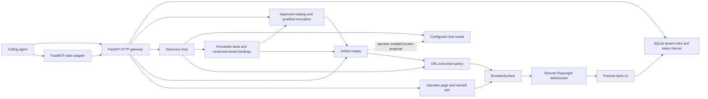

# Architecture

## System boundary

For discovery, the authenticated caller supplies a tenant ID, natural-language goal, target URL, proposed capability name, typed parameter definitions and values, and typed output definitions. For reuse, an agent selects an approved qualified name from the catalog and supplies only its tenant ID and typed values. Bank GPT owns the computer-use part. It does not decide whether a bank should perform a transaction or act as an account system of record.

The browser is remote, but control and run state are in the FastAPI process. The remote browser must reach the target URL. If the API and demo UI are on the developer workstation, the target URL must contain that workstation's LAN IP, not `127.0.0.1`.

## Discovery state machine

1. Validate the actor token, current tenant membership, input types, and target URL against the allowlist. Create a new isolated Chromium context and page on the remote Playwright server.
2. Observe up to 100 visible controls. The observation includes tag, label, text, form name, and a table row label. It omits input values and replaces table value cells with `[value]` before the model sees them.
3. Send the goal, observation, parameter *schemas* (not values), output schemas, and completed output names to the model. The model returns one JSON action: `click`, `type`, `extract`, `finish`, or `stuck`.
4. Validate action, index, parameter/output name, route, and risk. Build a target from stable information in the observed control. Act through the surface. Record a parameter reference rather than a typed value.
5. On `finish`, require every declared output to have been extracted, compile the selected checkpoint, verify it is visible, and save the capability.
6. On uncertainty, timeout, invalid decision, or policy stop, preserve the page and raise an intervention request. A human can operate the page and resume the same run.

The model never supplies arbitrary JavaScript or raw browser commands. It can select only visible controls by index and declared parameters/outputs. The system records structured actions and locator candidates, not the conversation transcript.

## Replay state machine

Replay accepts a base capability ID, tenant ID, typed input values, identity token, and scoped `secure_permissions` grant. It verifies grant scope, current tenant membership, and binding approval before opening a browser. It resolves each logical control through the selected tenant binding, opens a new context, navigates to the binding's entry URL, observes the page, and compares the live UI title and version with the binding fingerprints before executing steps. Before each step it checks the current origin/route and the declared business, hard, and recoverable conditions. It then verifies a unique visible target, performs the action, and logs the chosen locator. It checks the final checkpoint before returning outputs. Normal replay makes no model call.

`member_not_found` returns `business_outcome`. `permission_denied` returns `failure`. `session_expired` restarts at the entry URL once and replays from step one; a second expiry escalates. The demo's `verification_required` condition pauses at step 3 until an operator clicks **Verify lookup** on the held page. Missing or ambiguous targets, policy violations, and other unexpected states also pause for a human. With an explicit operator-only assisted fallback flag, one missing locator may be proposed by the configured model from a scrubbed observation. The same route, action, risk, unique-target, and final checkpoint checks apply. The proposal is logged and never edits an approved binding.

## Browser surface seam

`BrowserSurface` defines `start`, `set_demo_identity`, `navigate`, `url`, `observe`, `find`, `exists`, `same_target`, `destination`, `control`, `click`, `type`, `text`, and `close`. It stores the Playwright browser/context/page, but no Playwright object appears in the artifact. The locator union is deliberately typed. The current adapter handles CSS and XPath plus semantic shorthand for name, label, id, and exact text. Table values use a preceding header cell. A match must be unique and visible. A retry loop waits up to five seconds for the target.

For a legacy web app, an adapter would add frame paths and selectors scoped to the active frame, and could use an accessibility snapshot or screenshot when no reliable DOM signal exists. For a desktop app, the same methods could be backed by OS accessibility APIs or screenshot/coordinate actions. Coordinate targets would need a screenshot anchor, resolution, display scale, and confidence threshold in a new schema version. They should not be squeezed into a CSS field.

## Persistence and scale

Schema 2.0 stores one immutable base JSON file keyed by ID, plus separate versioned tenant binding JSON files under `artifacts/`; fictional tenant, user, customer, and account records are in SQLite. Binding files hold routes, UI fingerprints, locators, approval state, reviewed locator overrides, and stability review. An unversioned current-pointer file selects the active binding. Published binding URLs contain `192.168.z.zz`; the artifact store resolves that placeholder from the one configured allowed origin in ignored `.env` when loading a binding, and masks it again when writing. The base contract and action policy remain fixed. Version 1.1 is explicitly rejected. Active runs and browser handles live in a process-local dictionary. A process restart drops an active session and its handoff state. A production service would move run state, leases, and audit events to durable storage, and reserve a browser session to exactly one worker/operator owner.

The HTTP API is the tenant gateway for the agent catalog and invoke-by-qualified-name operations. The separate FastMCP stdio process calls those HTTP routes and the read-only run route. It holds no database connection and offers no browser action tool. This keeps membership, scoped grant, approval, and replay checks in the same HTTP path for both clients.

## Control transfer

A run has one owner: `automation` or `human`. An intervention changes owner to `human` and retains the same page. A random, non-secret browser-session ID remains stable across handoffs in that run. Operator APIs refuse actions unless the owner is `human` and the actor currently has an operator role in the run tenant. Resume records a handoff event and changes owner back to `automation`. During discovery, human clicks become recorded steps and human typing must name a declared parameter; this prevents hard-coded member IDs from entering a capability. During replay, the operator may fix the current state and retry, or explicitly complete one step after a matching operator action has been recorded. Held browser contexts remain until the run close endpoint or process exit; startup failures close their context immediately.
